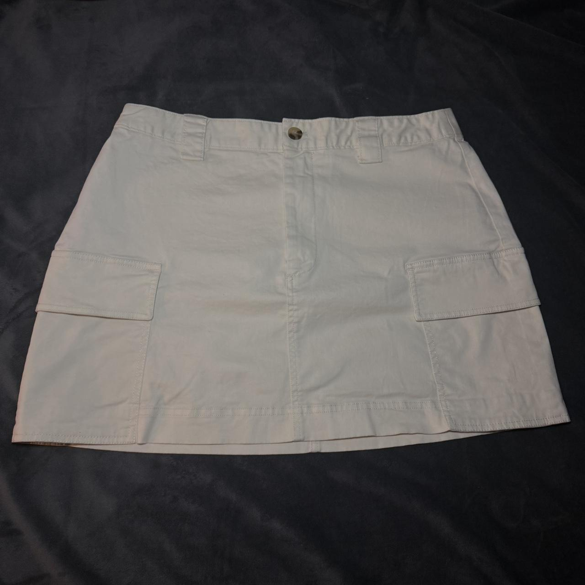
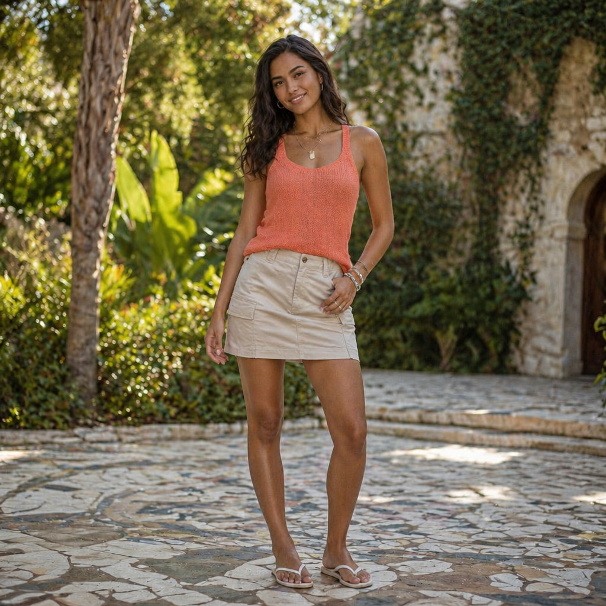
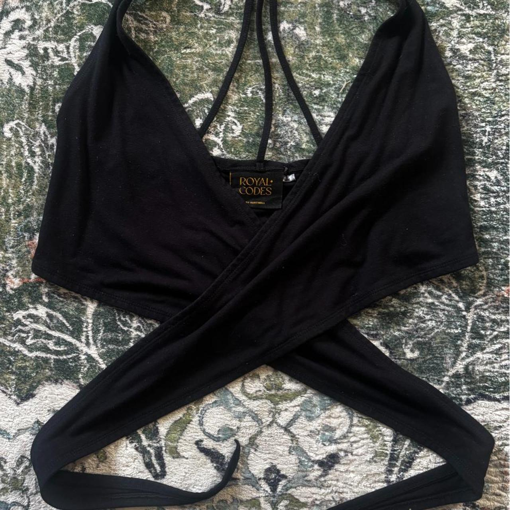
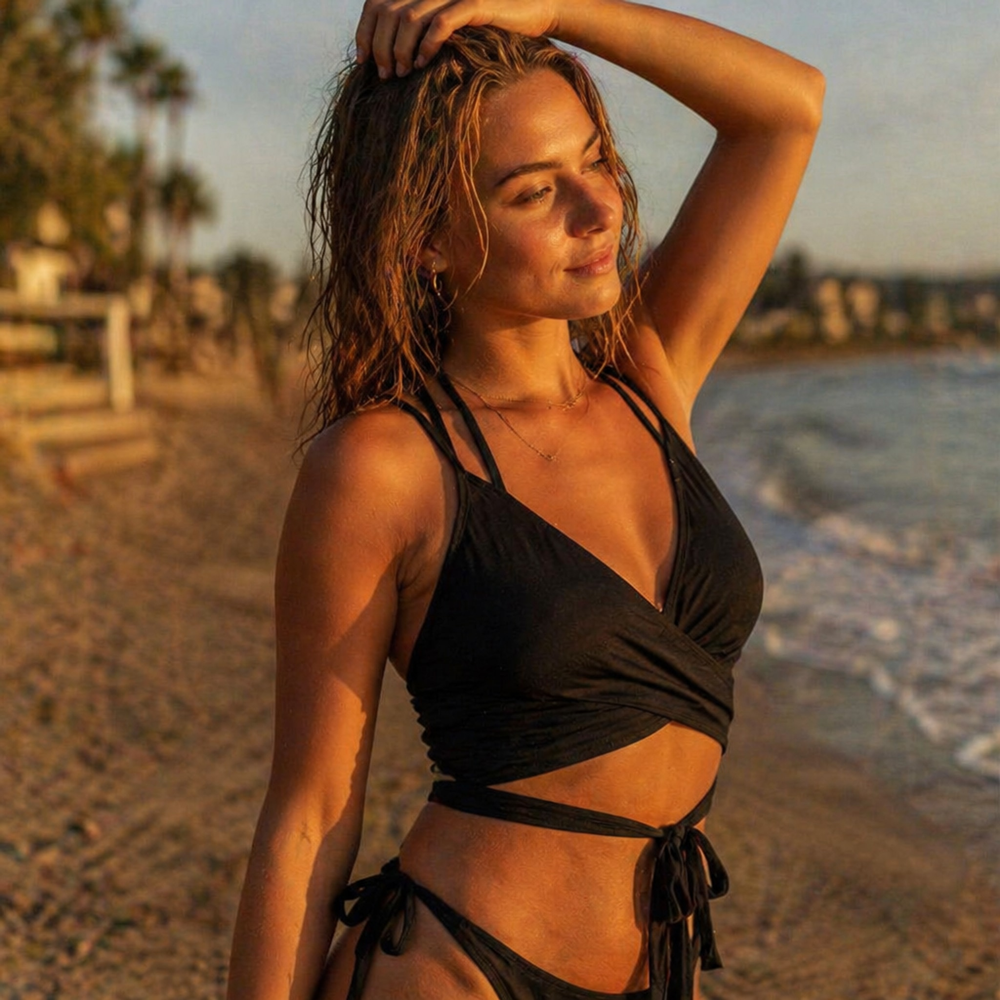
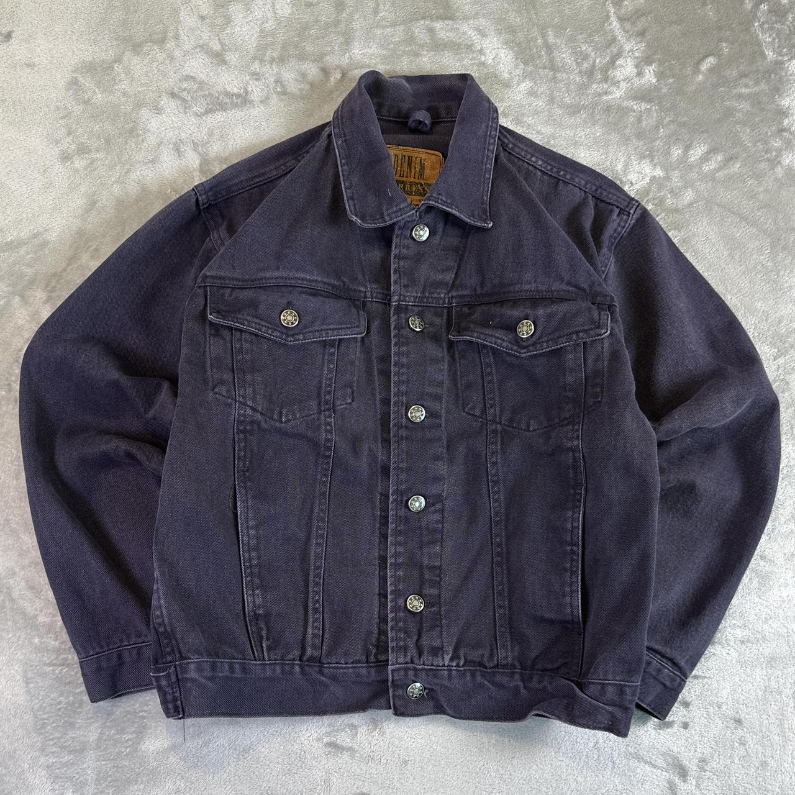
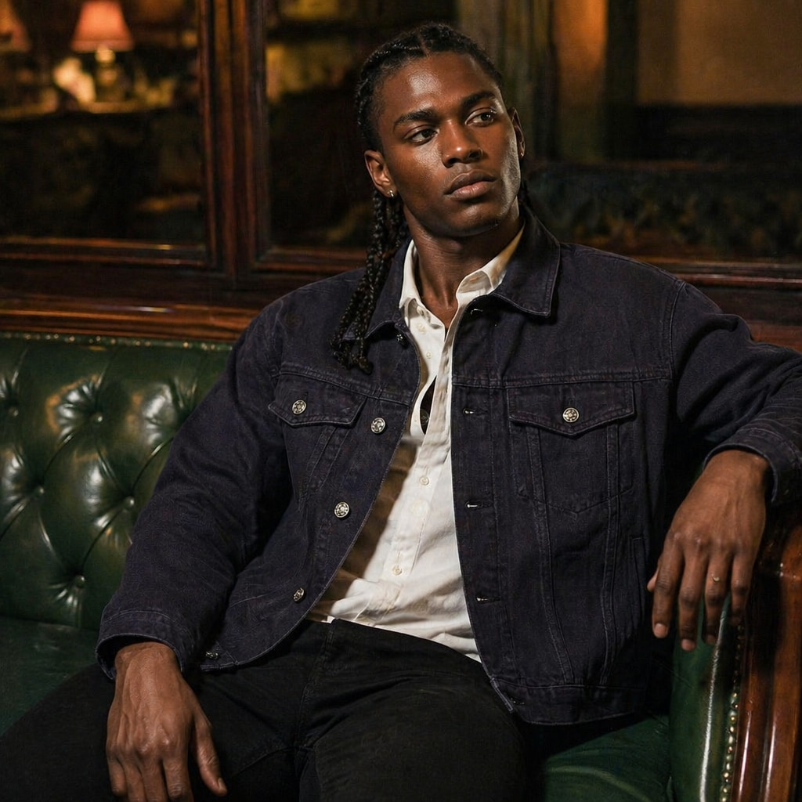
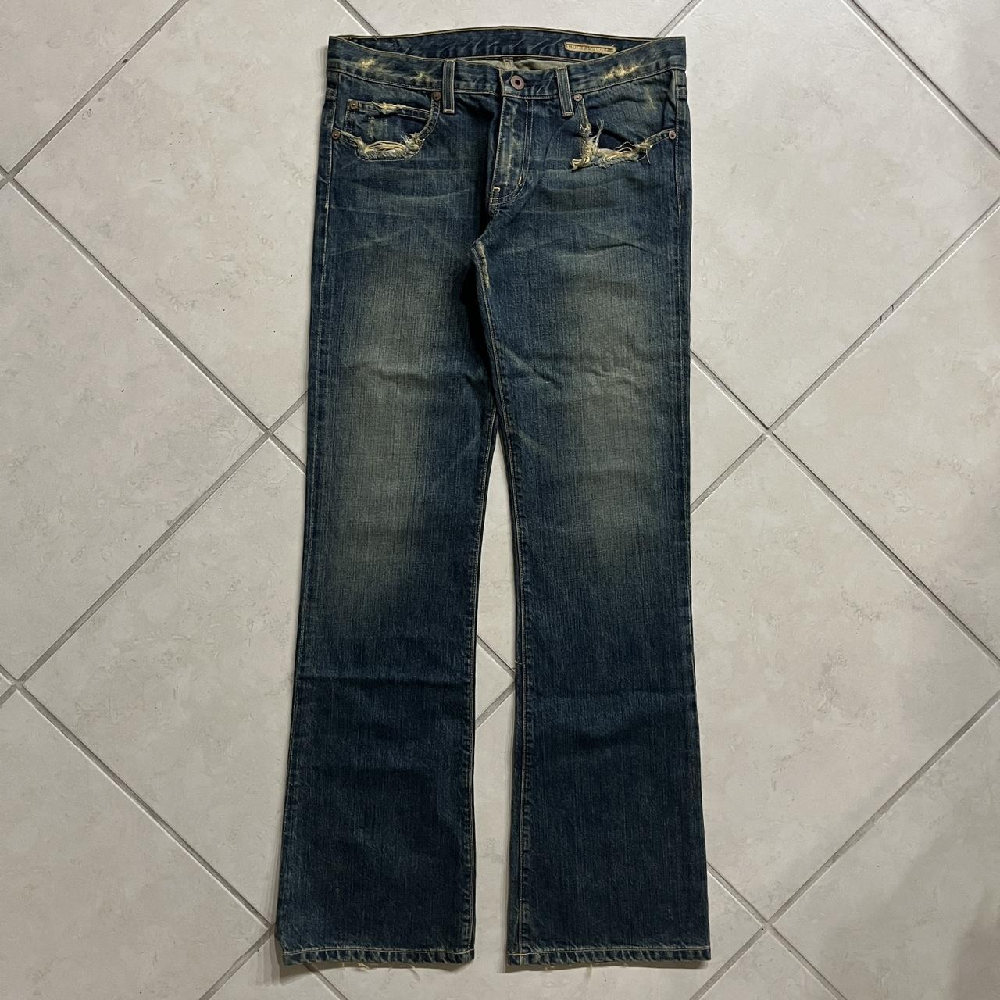
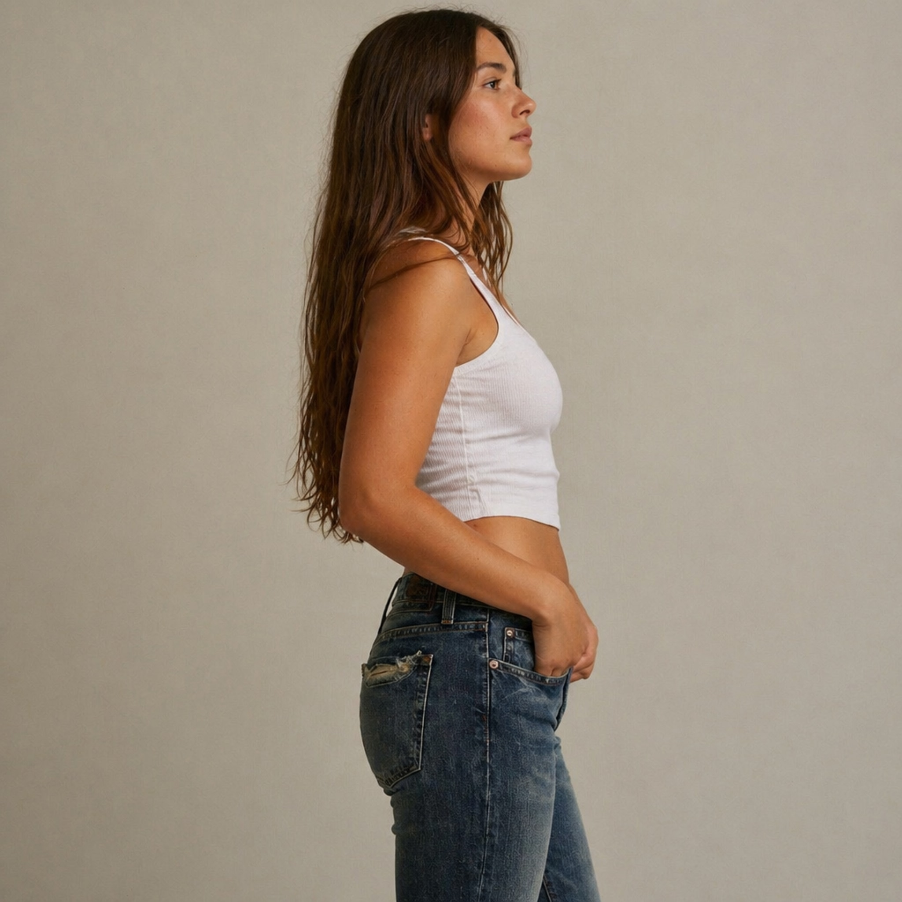

# Sceneify

Premium e-commerce lifestyle image generator. You drop in a flat product photo and an **image-based preset** (a folder of reference photos that show the visual register you want), and Sceneify produces a lifestyle render of *your* garment in that register — same buttons, same stitching, same exact color, on a real model in a real scene.

Live: https://sceneify-wheat.vercel.app (allowlisted Google sign-in only).

---

## What it does

| Flat product photo (input) | Lifestyle render (output) |
|---|---|
|  |  |
| White cargo skort, laid flat on velvet | Catalog-DTC register, Mediterranean garden |
|  |  |
| Black wrap top on a rug | Sun-drenched lifestyle register, golden-hour beach |
|  |  |
| Washed indigo denim jacket on concrete | Editorial-fashion register, cozy interior |
|  |  |
| Distressed bootcut jeans on tile | Studio register, profile crop |

The garment is preserved forensically — button count, pocket configuration, stitching color, hardware, wash, branding — while the scene, model, lighting, and pose come from the preset's reference images.

---

## Why presets are folders of images, not text

A text template like *"studio lifestyle"* means very different things to different brands. Aritzia studio lifestyle is not Tom Ford studio lifestyle is not Free People studio lifestyle. Sceneify lets you upload a folder of exemplar photos that define the register concretely — backdrop, lighting direction, model demographic, framing, post — and a vision LLM extracts those attributes into a generation prompt.

Add a new register by adding a new preset folder. No prompt engineering required.

---

## How it works

```
Source garment ─┐
Preset refs    ─┼─► gpt-4o (vision, generateObject)
(sampled       ─┤    ├─ system: register catalog + structure spec
 max 4/call)   ─┘    └─► { register, prompt }
                          ↑ the LLM auto-picks the visual register
                            from the references — no dropdown.
Source colors  ─┐
(sharp + 4-bit ─┘   injected as REQUIRED COLOR ANCHORS (HEX)
 histogram)         in the user message

constructedPrompt + source URL ─► fal.ai edit endpoint
  (gpt-image-2 / nano-banana / flux-kontext / flux-2)
                                   ├─► sharp resize to size profile
                                   ├─► save to Vercel Blob
                                   ├─► extract output palette → ΔE vs source
                                   └─► persist Generation row in Neon
```

**Two stages, one reason:** image-to-image alone with a generic prompt drifts the garment. The vision pass nails the garment description (color, hardware, pocket count, stitching) *and* extracts the scene from the references; the edit endpoint then preserves the garment while applying that scene.

**Color verification is post-flight:** we extract dominant colors from the output, match them to source colors via CIE76 ΔE in Lab space, and surface the worst match as a badge. <12 ΔE is good; ≥25 is severe drift.

---

## Stack

- Next.js 16 App Router (Turbopack)
- React 19, TypeScript 5, Tailwind v4
- AI SDK 6 + `@ai-sdk/openai` (gpt-4o, `generateObject`)
- `@fal-ai/client` for image generation (gpt-image-2, nano-banana, flux-kontext, flux-2)
- Neon Postgres + Drizzle ORM
- NextAuth v5 (Google, allowlisted emails)
- Vercel Blob for source/output/preset image storage
- `sharp` for resize + dominant-color extraction

---

## Listing packs

Sceneify can plan a multi-shot pack for Amazon, Shopify, Instagram, or TikTok. One source garment + one preset → N shots with varied framing (hero, three-quarter, profile, full-body, hardware detail, fabric detail), each sized to the platform's spec, all sharing a locked seed for model identity continuity (on seed-honoring endpoints).

---

## Repo layout

- `src/app/` — Next.js App Router (pages, API routes)
- `src/lib/prompt-construction.ts` — vision LLM call + structure spec
- `src/lib/image-gen.ts` — fal.ai endpoint mapping + fallback chain
- `src/lib/listing-packs.ts` — per-platform shot specs
- `src/lib/color-extraction.ts` — palette extraction + ΔE matching
- `src/lib/db/schema.ts` — Drizzle schema (preset, preset_image, source, generation)
- `src/lib/auth.ts` — NextAuth + email allowlist
- `src/components/dashboard.tsx` — single-page admin UI
- `docs/examples/` — the before/after pairs above

---

## Local development

```bash
pnpm install
pnpm dev:op   # 1Password-injected env, see scripts/dev-op
# or
pnpm dev      # standard, requires .env.local
```

Required env: `OPENAI_API_KEY`, `FAL_KEY`, `BLOB_READ_WRITE_TOKEN`, `DATABASE_URL`, `AUTH_SECRET`, `AUTH_GOOGLE_ID`, `AUTH_GOOGLE_SECRET`.

See [CLAUDE.md](CLAUDE.md) for the long-form architecture notes, including the non-obvious traps (gpt-image-2 size enum, shell env shadowing of `OPENAI_API_KEY`, drag-and-drop MIME quirks).
